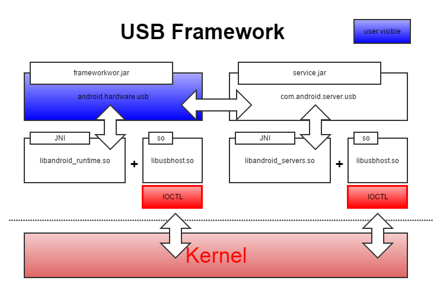

2015 Week 50
=============

### Article

* [실리콘 밸리의 코드리뷰는 어떻게 하나요?](http://sv-story.blogspot.kr/2013/04/blog-post_28.html)
* [똑똑한 프로그래머를 바보로 만드는 방법](http://www.moreagile.net/2014/06/dontPerformance-basedsystem.html)
* [구글 SW 교육 담당자에게 물었습니다…”코딩 교육이란?”](http://www.bloter.net/archives/245251)
* [웹 개발자 직군 정리 - 백앤드, 프론트 앤드, 퍼블리셔 등](http://emptydream.tistory.com/3918)
* [“완전 분해” RAM의 구성과 동작 원리](http://www.itworld.co.kr/slideshow/96862)
* [[경제]미국 기준금리 인상 후폭풍2 : 희망, 있다](http://www.ddanzi.com/ddanziNews/57644908)
* [MS, 웹브라우저 ‘엣지’ 엔진 오픈소스로 공개](http://www.bloter.net/archives/245433)
* [구글의 역대 최강 물체 인식 엔진(딥러닝 기반) 공개](https://www.tensorflow.org/versions/master/tutorials/image_recognition/index.html)
* [1분이면 이해하는 pull request를 이용한 코드리뷰! ](https://www.youtube.com/watch?v=ssDHUyrQ8nI)
* [[친절한혜강씨의 PPT강의] 멋진 브러쉬 소스에 이미지 왜곡 없이 합성하기](http://samsungblueprint.tistory.com/731)
* [초보 개발자가 꼭 알아 두어야 할 다섯 가지 기술들](http://www.moreagile.net/2014/12/HowtoBecomeAnExpertDeveloper.html)
* [IT엔지니어를 위한 영어공부 사이트를 소개합니다.](http://www.english4it.com/)
* [웹 개발자의 상식! HTTP상태코드에 대한 명쾌한 정리!](http://racksburg.com/choosing-an-http-status-code/)
* [네트워킹 기초 - 개발자와 인프라운영자 모두에게 꼭 필요한 지식](https://mva.microsoft.com/ko/training-courses/--8249?l=q69gup0qb_1200115888)
* [비트코인과 블록체인 기술](http://d2.naver.com/helloworld/8237898)
* [수학을 포기한 직업 프로그래머가 머신러닝 학습을 시작하기위한 학습법 소개](http://www.moreagile.net/2015/05/how-to-start-machine-learning-study.html)
* [구글의 양자 컴퓨터가 1억배 빠르다](http://googleresearch.blogspot.kr/2015/12/when-can-quantum-annealing-win.html)
* [이고잉님의 검색엔진 최적화 강의](https://opentutorials.org/course/2039/10995)
* [Java Garbage Collection](http://d2.naver.com/helloworld/1329)
* [iOS와 Android에서
가상 키보드를 사라지게 하기](https://realm.io/kr/news/tmi-dismissing-keyboard-ios-android/)
* [오픈소스 공헌을 위한 필수 지식](http://www.slideshare.net/blrunner/ss-55961507)
* [구글은 왜 인공지능 엔진을 개방했을까](http://techholic.co.kr/archives/45326)
* [구글 애널리틱스 완벽 가이드: 시작하기 편](http://ppss.kr/archives/63430)
* ['헬SW, 한국'..해외로 떠나는 개발자](http://m.media.daum.net/m/media/digital/newsview/20151210163407869)
* [GitHub - 프로젝트에 기여하기](https://git-scm.com/book/ko/v2/GitHub-%ED%94%84%EB%A1%9C%EC%A0%9D%ED%8A%B8%EC%97%90-%EA%B8%B0%EC%97%AC%ED%95%98%EA%B8%B0)

### Language


### Android

* [usb-serial-for-android](https://github.com/mik3y/usb-serial-for-android)
* [[기술 컬럼] Android ADK - USB Host Mode](http://devguru.co.kr/blog/5851/)
* USB Framework Block Diagram



* [USB Class Codes](http://www.usb.org/developers/defined_class)

*How to read USB Class Codes:*

```vim
example:
interfaces [0] UsbInterface[mId=0,mClass=6,mSubclass=1,mProtocol=1,mEndpoints=[Landroid.os.Parcelable;@40dc7040] 

class 6, subclass 1, Protocol 1:
=> Still Imaging

Base Class: 0x06
SubClass: 0x01
Protocol: 0x01
Meaning: Still Imaging device
```

* [Android USB Part1.pdf](res/Android USB Part1.pdf)
* [Android USB Part2.pdf](res/Android USB Part2.pdf)
* [Android NDK - IOCTL](http://www.programering.com/a/MDM4EjNwATQ.html)
* [Android MVP 강의](https://www.youtube.com/playlist?list=PL8LCyzZVoOd-hhtdSSoHNtifB0sIrkhlr)
* [고정키를 클라언트에 삽입하는 클라이언트 구조는 해킹에 취약합니다.](https://www.facebook.com/baramnemse/posts/1703414303222490) http://repo.kr/android-app-security/seccon-2015-writeup-reverse-engineering-android-apk-2-unknown-400-score/


### OS / Linux / Windows


### Mobile / Embedded / Soc
